# Ejercicios - 2 - imagenes

>Realizado por: Pelayo de la Fuente Díaz

cuando se termina el ejercicio se merge a y push

se hace una rama de lo que vayas haciendo y se guarda

no hacer el merge con el main antes de acabar el ejercicio

cada ejercicio se hace en una rama

checktout -b ejercicio 1
subes todo, haces el comit y despues el push

y cuando este todo correcto hacer el merge

trabajar en la rama hasta acabar el ejercicio 2 y luego subirlo todo arriba

1: creas una rama git checkout -b nombre y haces los ejercicios, despues haces git add . y git commit, despues git push origin nombrederama y una vez subidos, desde la rama main haces git pull para actualizar el repositorio local

**hacer la rama con git branch y git checkout para ir a ella, despues haces el ejercicio y haces git add ., git commit - m "mensaje", git push origin nombrerama**

## EJERCICIOS

1. Descarga las siguientes imágenes: `ubuntu:18.04`, `httpd`, `tomcat:9.0.39-jdk11`,`jenkins/jenkins:lts`, `php:7.4-apache`.

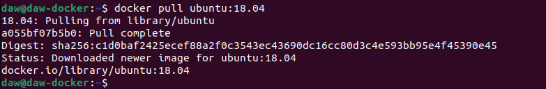

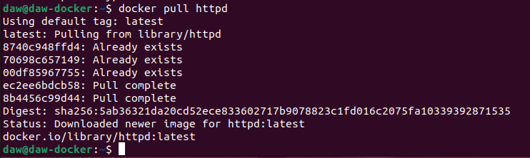

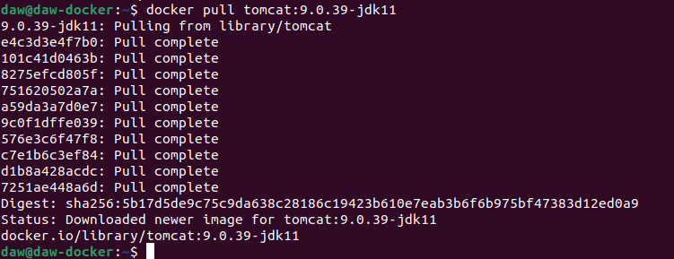

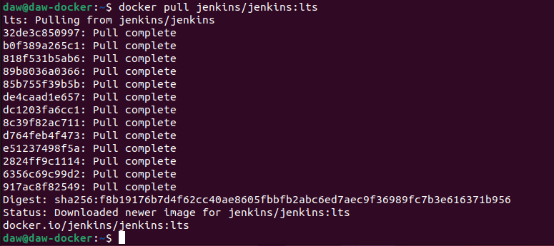

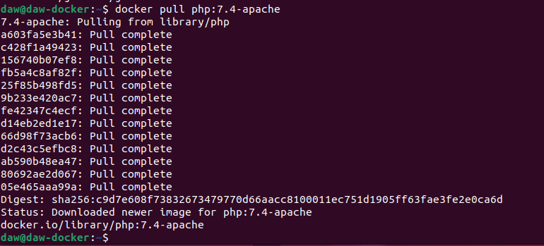

2. Muestras las imágenes que tienes descargadas.

`docker images`

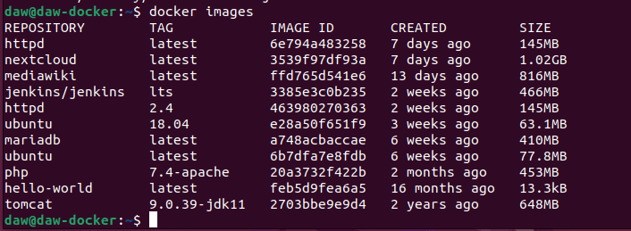

3. Crea un contenedor demonio con la imagen php:7.4-apache.

`docker run -d --name contenedorDemonio -p 8080:80 php:7.4-apache bash`

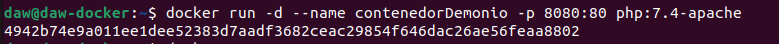

4. Comprueba el tamaño del contenedor en el disco duro.

`docker ps -a -s`

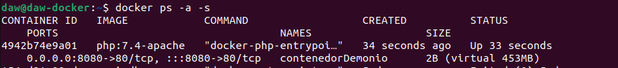

5. Con la instrucción docker cp podemos copiar ficheros a o desde un contenedor. Puedes encontrar información es esta página. Crea un fichero en tu ordenador, con el siguientec ontenido:

Copia un fichero `info.php` al directorio `/var/www/html` del contenedor con docker cp.

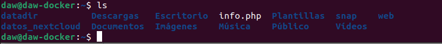

`docker cp /home/daw/info.php contenedorDemonio:/var/www/html/.`

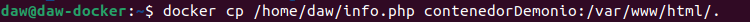

6. Vuelve a comprobar el espacio ocupado por el contenedor.

`docker ps -a -s`

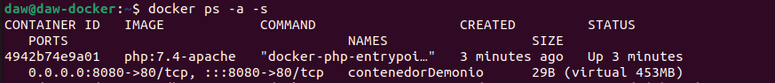

7. Accede al fichero info.php desde un navegador web.

`localhost:8080/info.php`

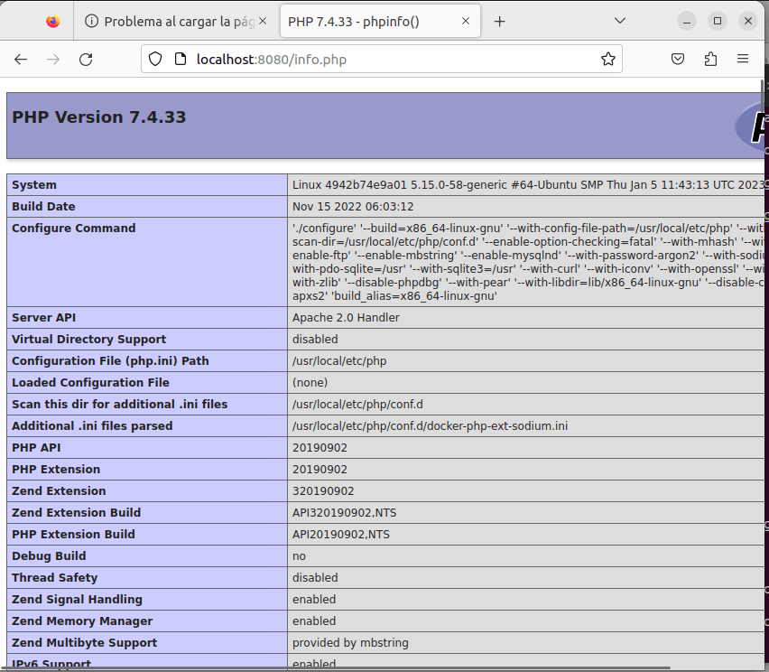

