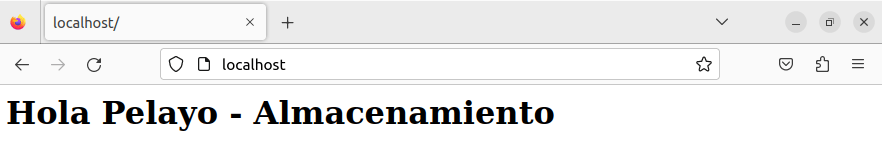

## Ejercicios almacenamiento - Docker

> Tarea realizada por: Pelayo de la Fuente Díaz

# VOLÚMENES DOCKER

1. Crea un volumen docker que se llame `miweb`.

`docker volume create miweb`

2. Crea un contenedor desde la imagen `php:7.4-apache` donde montes en el directorio `/var/www/html` (que sabemos que es el DocumentRoot del servidor que nos ofrece esa imagen) el volumen docker que has creado.

`docker run -d -p 80:80 -v miweb:/var/www/html --name contenedor_miweb php:7.4-apache`

3. Utiliza el comando docker cp para copiar un fichero index.html en el directorio `/var/www/html.`

`docker cp /home/daw/index.html contenedor_miweb:/var/www/html/.`

4. Accede al contenedor desde el navegador para ver la información ofrecida por el fichero index.html.

`http://localhost:80`

5. Borra el contenedor

`docker rm -f contenedor_miweb`

6. Crea un nuevo contenedor y monta el mismo volumen como en el ejercicio anterior.

`docker run -d -p 80:80 -v miweb:/var/www/html --name contenedor_miweb2 php:7.4-apache`

7. Accede al contenedor desde el navegador para ver la información ofrecida por el fichero index.html. ¿Seguía existiendo ese fichero?

Si, sale la misma información, ya que con los volumenes la información es persistente

# BIND MOUNT

1. Crea un directorio en tu host y dentro crea un fichero `index.html`.

`mkdir miweb`

`nano index.html`

2. Crea un contenedor desde la imagen php:7.4-apache donde montes en el directorio `/var/www/html` el directorio que has creado por medio de bind mount.

`docker run -d -p 80:80 -v /home/daw/miweb:var/www/html --name contenedor_miweb php:7.4-apache`

3. Accede al contenedor desde el navegador para ver la información ofrecida por el fichero index.html.

4. Modifica el contenido del fichero index.html en tu host y comprueba que al refrescar la página ofrecida por el contenedor, el contenido ha cambiado.

5. Borra el contenedor

`docker rm -f e0070`

6. Crea un nuevo contenedor y monta el mismo directorio como en el ejercicio anterior.

`docker run -d -p 80:80 -v /home/daw/miweb:/var/www/html --name contenedor_miweb2 php:7.4-apache`

7. Accede al contenedor desde el navegador para ver la información ofrecida por el fichero index.html. ¿Se sigue viendo el mismo contenido?

Si, se sigue viendo el mismo contenido

