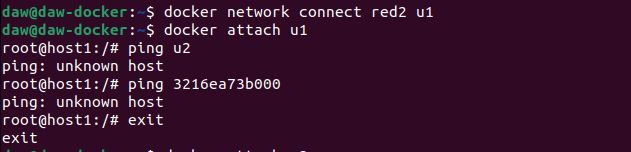

# Redes en docker - Ejercicios

>Tarea realizada por: Pelayo de la Fuente Díaz

## Trabajar con redes docker

1. Vamos a crear dos redes de ese tipo (BRIDGE) con los siguientes datos:

**Red1**
Nombre: red1,
Dirección de red: 172.28.0.0,
Máscara de red: 255.255.0.0,
Gateway: 172.28.0.1

**Red2**
Nombre: red2
Es resto de los datos será proporcionados automáticamente por Docker.

`docker network create -d bridge --subnet 172.28.0.0/16 --gateway 172.28.0.1 red1`

`docker network create red2`

2. Poner en ejecución un contenedor de la imagen `ubuntu:20.04` que tenga como hostname
`host1` , como IP `172.28.0.10` y que esté conectado a la red1. Lo llamaremos u1 .

3. Entrar en ese contenedor e instalar la aplicación ping `( apt update && apt install
inetutils-ping )`.

4. Poner en ejecución un contenedor de la imagen ubuntu:20.04 que tenga como hostname
host2 y que esté conectado a la red2. En este caso será docker el que le de una IP correspondiente
a esa red. Lo llamaremos u2 .

`docker run -it --name u2 --network red2 --hostname host2 ubuntu:20.04`

5. Entrar en ese contenedor e instalar la aplicación ping ( apt update && apt install
inetutils-ping ).

`docker start u2`

`docker attach u2`

`apt update && apt install inetutils-ping`

6. El documento debe contener, además, los siguientes pantallazos:

-Pantallazo donde se vea la configuración de red del contenedor u1.

`docker inspect u1`

-Pantallazo donde se vea la configuración de red del contenedor u2.

`docker inspect u2`

-Pantallazo donde desde cualquiera de los dos contenedores se pueda ver que no podemos hacer ping al otro ni por ip ni por nombre.

-Pantallazo donde se pueda comprobar que si conectamos el contenedor u1 a la red2 (con docker network connect ), desde el contenedor u1, tenemos acceso al contenedor u2 mediante ping, tanto por nombre como por ip.

`docker network connect red2 u1`

`docker attach u1`

`ping 172.18.0.2`

## Despliegue de NextCloud y MariaDB/postgreSQL

1. Crea una red de tipo bridge.

`docker network create red_pelayo`

2. Crea el contenedor de la base de datos conectado a la red que has creado. La base de datos se debe configurar para crear una base de dato y un usuario. Además el contenedor debe utilizar almacenamiento (volúmenes o bind mount) para guardar la información. Puedes seguir la documentación de mariadb o la de PostgreSQL .

`docker run -d --name servidor_mysql --network red_pelayo -v /opt/mysql_nextcloud:/var/lib/mysql -e MYSQL_DATABASE=bd_nextcloud -e MYSQL_USER=pelayonextcloud mariadb:10.5`

3. A continuación, siguiendo la documentación de la imagen nextcloud , crea un contenedor conectado a la misma red, e indica las variables adecuadas para que se configure de forma adecuada y realice la conexión a la base de datos. El contenedor también debe ser persistente usando almacenamiento.

`docker run -d --name servidor_nextcloud -p 8080:80 --network red_pelayo -v nextcloud:/var/www/html -e MYSQL_DATABASE=bd_nextcloud -e MYSQL_USER=pelayonextcloud nextcloud`

4. Accede a la aplicación usando un navegador web.

6. El documento debe contener, además, los siguientes pantallazos:

Los pantallazos estan hechos en sus respectivos apartados.

